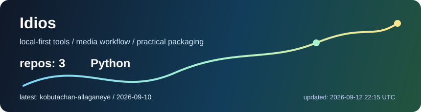

# Idios

日常的に発生するデータ処理を片付けるツール・ソフトウェアを作っている。
配布しやすくすぐ使えるパッケージングを心がけている。

<p>
  
  
  
  
  
</p>

```text
local-first tools / media workflow / practical packaging
```



## 作っているもの

- **ローカルファーストなメディアツール**: 画像・動画・メタデータを手元のPCで扱うためのツール
- **AIを活用した作業補助**: タグ付け、検索、分類、類似検出などを支援する仕組み
- **デスクトップユーティリティ**: 非開発者でも使えるWindows向けGUI/CLI
- **実用的な配布設計**: README、依存関係、ライセンス、リリース導線まで含めた配布

## 活動状況

<!-- ACTIVITY:START -->
- 公開中の表示対象リポジトリ: **3**
- 主な言語: **Python**
- 最終更新: 2026-09-05 22:03 UTC

| リポジトリ | 内容 | 最終更新 |
| --- | --- | --- |
| [kobutachan-allaganeye](https://github.com/Idios/kobutachan-allaganeye) | FF14 フロントラインの長時間録画動画を、試合ごとに自動分割するツール。 | 2026-09-05 |
| [kobutachan-ffxiv-research](https://github.com/Idios/kobutachan-ffxiv-research) | FFXIVに関する各種調査レポートおよびその調査スキル・ツール | 2026-09-01 |
| [claudecode-discord-presence](https://github.com/Idios/claudecode-discord-presence) | Show your Claude Code session as Discord Rich Presence status. | 2026-08-31 |
<!-- ACTIVITY:END -->
